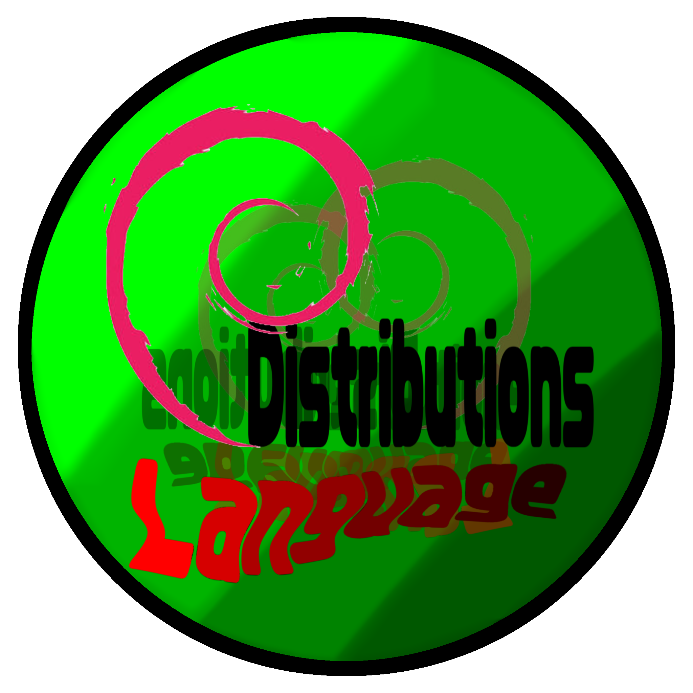

# DDLanguage (Debian Distributions Language)

  

  

**English:**  
DDLanguage is a programming language created specifically for Debian and Debian-based distributions. It features a simple, Python-like syntax, static typing, and native compilation through C++. It includes built-in libraries for GTK3 graphics (DDLGraphic) and a full web browser engine (DDLBrowser).  
**License: GNU General Public License v3.0**

**Русский:**  
DDLanguage — язык программирования, созданный специально для Debian и дистрибутивов на его основе. Он отличается простым, похожим на Python синтаксисом, статической типизацией и нативной компиляцией через C++. Включает встроенные библиотеки для GTK3-графики (DDLGraphic) и полноценный браузерный движок (DDLBrowser).  
**Лицензия: GNU GPL v3.0**

**Հայերեն (Армянский):**  
DDLanguage-ը ծրագրավորման լեզու է, որը ստեղծվել է հատուկ Debian-ի և Debian-ի վրա հիմնված բաշխումների համար: Այն ունի Python-ի նման պարզ շարահյուսություն, ստատիկ տիպավորում և կոմպիլյացիա C++-ի միջոցով: Ներառում է ներկառուցված գրադարաններ GTK3 գրաֆիկայի (DDLGraphic) և վեբ-դիտարկիչի (DDLBrowser) համար:  
**Լիցենզիա՝ GNU GPL v3.0**
